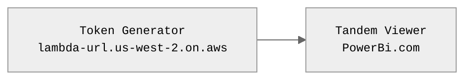
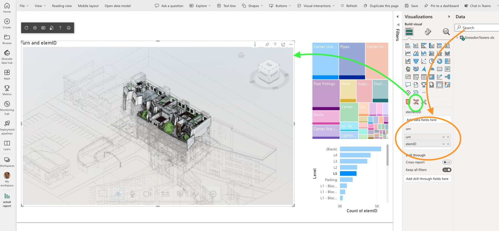

# powerBI-tandem-viewer

This is the visual component for Tandem Viewer, embedded inside PowerBi.  

 

## NOTES
- It uses two Legged Auth (see hello world Tandem example)
- A Lambda service provides tokens
- The tokens are locked to the Service Account permissions

 

## SETUP

From the diagram:

### ADD VIZ (Green Arrow)
1. Click 'More' button, add Visual Component from file
2. Select `/dist/tandem-viz-powrebi.pbiviz` 
3. Click new icon
4. The Tandem viewer is added to the canvas (green arrow)

### CONFIGURE (Orange Arrow)
5. Search for `urn`, `elemID`
6. Drag these into URN field

## RUN

Click on elements in the chart to see the viewer change appearance
